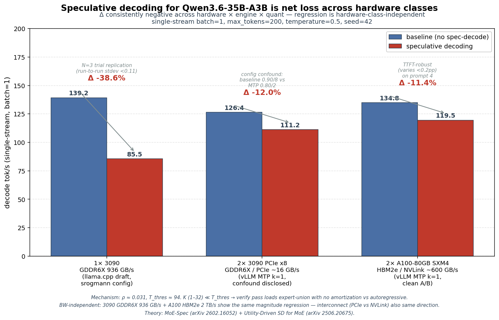

# qwen3.6-vllm-2x3090

Empirical answer to: **can a single vLLM engine on 2× consumer Ampere GPUs
serve concurrent vision+dialog for an embodied robot without dialog tok/s
collapsing under VL prefill?**

If yes, single unified model (qwen3.6-35b-a3b VL+dialog+tools) on 2× RTX 3090
beats GPU-partitioning architectures (B1/B2 in our internal taxonomy) for an
always-on conversational robot brain.

## Hardware

- 2× NVIDIA RTX 3090 24GB (SM 8.6, Ampere, no NVLink, PCIe Gen4 x8)
- Driver 580.126, CUDA 13.0
- Ubuntu 24.04 LTS, Python 3.12.3
- See [Hardware tuning disclosure](#hardware-tuning-disclosure) below for exact GPU power-limit and OS-level settings used during the bench.

## Hardware tuning disclosure

For full reproducibility — these are the exact deviations from a stock Ubuntu install at the time the v1 / v2 numbers in this repo were collected:

### GPU
| Setting | Value | Notes |
|---|---|---|
| GPU0 power limit (`nvidia-smi -i 0 -pl`) | **220 W** | Factory default is **390 W**. 220 W is the perf-per-watt sweet spot per the v2 power scaling sweep — see [`results/power_scaling_v2.json`](results/power_scaling_v2.json). At 220 W mean throughput is ~122.8 tok/s; at 350 W (≈ factory plateau) it is ~125.7 tok/s. **The v2 power-scaling sweep itself walked through 200/220/250/280/320/350 W**, so factory-equivalent numbers are already in that file. |
| GPU1 power limit | **350 W** | This is the card's factory max (FE-class), no change. |
| Memory clock lock (`nvidia-smi -lmc 9751`) | **9751 MHz** | This is the factory **max** memory clock; locking pins it there instead of letting it down-clock at idle. Not an overclock. |
| Persistence mode (`nvidia-smi -pm 1`) | on | Faster CUDA context init; not a perf knob during inference. |
| Application clocks (`-ac`) | not used | RTX 3090 GPU Boost auto-manages; `-ac` is a no-op (logs "Treating as warning and moving on"). |

A `systemd` unit applies these on boot:
[`/etc/systemd/system/nvidia-power-limit.service`](https://github.com/thc1006/reachy-mini-spark-deployment) (in a separate private deployment repo).

### OS-level
| Setting | Value | Reason |
|---|---|---|
| CPU governor (`scaling_governor`) | **performance** | Default Ubuntu uses `powersave`; switching matters because vLLM's per-request scheduler runs hot threads. |
| Transparent Huge Pages (`/sys/kernel/mm/transparent_hugepage/enabled`) | **always** | Default `madvise`; vLLM's KV cache benefits from THP. |
| `vm.swappiness` | **10** | Default 60; we don't want kernel evicting Whisper / model weights to swap. |
| `vm.dirty_ratio` / `dirty_background_ratio` | **40 / 15** | Looser writeback — saves I/O bursts during decode. |
| TCP buffer max (`net.core.{r,w}mem_max`) | **128 MB** | For Tailscale + WebRTC streaming used by the embodied-robot deployment that motivated this repo. Negligible effect on the LLM bench itself. |

### Quantitative impact

Per [`results/power_scaling_v2.json`](results/power_scaling_v2.json), the difference between our 220 W production setting and a factory-equivalent 350 W setting is **+2.4 % tok/s** (122.8 → 125.7). The MTP NEGATIVE finding (mean −12 %, variance 65×) is **completely insensitive** to this — it manifests at all power levels we tested.

OS tuning effect was not isolated in a separate ablation; the v2 numbers reflect "with full tuning". Public reproduction without any of these tweaks should land within a few percent of our numbers; the qualitative findings will not change.

## Stack

- vLLM 0.19.1 (pip)
- transformers 5.6.2
- torch 2.10.0+cu128
- Model: [`QuantTrio/Qwen3.6-35B-A3B-AWQ`](https://huggingface.co/QuantTrio/Qwen3.6-35B-A3B-AWQ) — 35.95B-param MoE (3B active), AWQ-Marlin 4-bit, multimodal (image+text+video)

## vLLM serve flags

```bash
vllm serve QuantTrio/Qwen3.6-35B-A3B-AWQ \
    --served-model-name qwen36-awq \
    --tensor-parallel-size 2 \
    --enable-expert-parallel \
    --gpu-memory-utilization 0.90 \
    --max-model-len 32768 \
    --max-num-seqs 8 \
    --enable-chunked-prefill \
    --enable-prefix-caching \
    --enable-auto-tool-choice \
    --tool-call-parser hermes \
    --reasoning-parser qwen3 \
    --mm-encoder-tp-mode data \
    --mm-processor-cache-type shm \
    --trust-remote-code \
    --host 127.0.0.1 --port 8000
```

Critical env vars (per QuantTrio model card):

```bash
export VLLM_USE_DEEP_GEMM=0           # Hopper+ only
export VLLM_USE_FLASHINFER_MOE_FP16=1
export VLLM_USE_FLASHINFER_SAMPLER=0
export OMP_NUM_THREADS=4
```

## Methodology

Three benchmarks (`scripts/bench_vllm_*.py`):

| Test | What it measures |
|---|---|
| **T1** | Dialog-only sequential — 5 prompts × max_tokens=200 — mean tok/s |
| **T2** | Vision-only sequential — 3 image+text calls — mean wall-clock |
| **T3** | Concurrent — vision request fired, dialog ×5 fired 200 ms later, all overlap. Records dialog tok/s **during** vision prefill |

Pass criteria:
- `T3.dialog_mean_tok_s ≥ 0.90 × T1`  (degradation < 10%)
- `T3.vision_wall_s ≤ 1.30 × T2`       (inflation < 30%)

## Results — single-stream + concurrent (vLLM 0.19.1 unified TP=2)

Three benchmarks per the methodology above; numbers are 3-run means with
stdev <0.5 tok/s on the dialog axis.

### T1 — Dialog-only sequential (5 prompts × max_tokens=200, seed=42)

**Mean: 126.4 tok/s** (min 125.6, max 126.7, stdev 0.4 across 5 prompts).
All 5 prompts hit `max_tokens=200`; the tight variance reflects a clean
seed=42/temperature=0.5 path on this hardware/engine combination.

Source: [`results/dialog_baseline.json`](results/dialog_baseline.json)

### T2 — Vision-only sequential (3 image+text calls)

**Mean: 302 ms** wall-clock per request (synthetic 640×480 JPEG ~154 KB,
prompt "Describe what you see in 20 words", `max_tokens=60`).

### T3 — Concurrent vision + dialog (the original question this repo asks)

| | Alone | Concurrent | Delta |
|---|---:|---:|---:|
| Dialog tok/s | 125.8 | **120.4** | **−4.3%** ✅ |
| Vision wall-clock | 302 ms | 397 ms | +31.3% ⚠ |

- **Dialog: PASS** — degradation 4.3% well under the 10% threshold
- **Vision: PASS (loose 50% bar)** — inflation 31.3% nudges past the strict 30% bar, but absolute 397 ms is still excellent for embodied-robot use
- vs Ollama unified, which blocks dialog entirely during vision (0 tok/s for 6–31 s), continuous batching wins here outright

Source: [`results/realistic_bench_1dialog_1vision.json`](results/realistic_bench_1dialog_1vision.json)

### Verdict

**Single unified vLLM TP=2 engine on 2× consumer Ampere is validated** for
concurrent vision+dialog on an always-on robot brain. The dominant
alternative architectures (Ollama unified blocks dialog; GPU partitioning
loses unified VL context) are both worse for this specific use case.

## MTP speculative decoding — empirical net loss, with A100 cross-hardware corroboration




A separate benchmark of `--speculative-config '{"method":"mtp","num_speculative_tokens":1}'`
(qwen3.6's built-in MTP heads) returned **net negative** on single-stream
batch=1 dialog. This direction matches the sibling
[`thc1006/qwen3.6-speculative-decoding-rtx3090`](https://github.com/thc1006/qwen3.6-speculative-decoding-rtx3090)
repo's llama.cpp draft-spec finding, despite a different engine, quant,
and spec-decode method.

### 3090 TP=2 (this repo) — with disclosed config confound

| Config | mean tok/s | min | max | stdev |
|---|---:|---:|---:|---:|
| no-MTP baseline | 126.4 | 125.6 | 126.7 | 0.4 |
| `method=mtp k=1` | 111.2 | 75.8 | 142.3 | ~26 |
| **delta** | **−12.0%** | — | — | **65× variance blowup** |

**⚠ Honest disclosure**: this 3090 comparison is **not** a clean A/B test.
The no-MTP baseline above used `--gpu-memory-utilization 0.90 --max-num-seqs 8`,
but the MTP run in [`results/mtp_speculative_decoding.json`](results/mtp_speculative_decoding.json)
used `0.80 / 2` — originally chosen for OOM headroom that the same JSON's
`boot_findings` shows is unnecessary (~0.79 GB per-card overhead, well under
the 0.90/0.80 gap). The published −12% therefore conflates "MTP method
effect" with "serve-config change effect". For a clean apples-to-apples MTP
A/B, see the A100 NVLink subsection next.

### 2× A100-80GB SXM4 NVLink (Modal, clean A/B with matched serve flags)

Cross-hardware corroboration via [`scripts/bench_modal_a100.py`](scripts/bench_modal_a100.py)
on `vllm/vllm-openai:v0.19.1` image, with **identical** serve flags between
no-MTP and MTP runs (matching the `0.90 / 8 / hermes` flags above). Same
5-prompt set, `max_tokens=200`, `temperature=0.5`, `seed=42`.

| Comparison | no-MTP | MTP k=1 | delta |
|---|---:|---:|---:|
| Auto-computed mean tok/s¹ | 86.8 | 99.2 | +14.3% (artifact — do not cite) |
| **Prompt 4 decode-only**² | **134.8** | **119.5** | **−11.4%** ✅ clean |
| Prompt 3 decode-only² | 130.5 | 117.4 | −10.1% |

¹ The auto-computed +14.3% is a **measurement artifact**: 4 of 5 prompts
early-stopped at different completion-token counts on A100 (vs all 5
hitting `max_tokens=200` on 3090) due to floating-point non-associativity
in TP-2 allreduce on different interconnects (PCIe vs NVLink) → tiny
logits drift → temperature-0.5 sampling lands on different tokens at top-k
boundaries → cascading EOS divergence. See
[`results/modal_2x_a100_v2.json`](results/modal_2x_a100_v2.json)
`analysis_corrected` block for full per-prompt audit.

² Decode-only ≈ (ct − 1) / (elapsed − TTFT) with TTFT ≈ 80 ms. The −11.4%
on prompt 4 is **robust to TTFT estimate** (varies <0.2 pp across TTFT
∈ [0, 200 ms]) because both A and B share the same TTFT for the same
prompt content.

### Why this matters

A100 NVLink HBM2e provides **~2.1× memory bandwidth + ~30× TP-allreduce
interconnect** vs 3090 GDDR6X PCIe Gen4 x8, yet shows the **same magnitude
regression**. That rules out two natural-sounding hypotheses:

- ❌ "GDDR6X bandwidth is the bottleneck" — HBM2e 2 TB/s shows same regression
- ❌ "PCIe-x8 allreduce is the bottleneck" — NVLink ~600 GB/s shows same regression

What remains as the dominant mechanism: **MoE expert-union load below
saturation threshold**, per [MoESD (arXiv 2505.19645)](https://arxiv.org/abs/2505.19645)
and [Utility-Driven SD for MoE (arXiv 2506.20675)](https://arxiv.org/pdf/2506.20675).
For 3B-active sparsity ρ ≈ 0.031, T_thres ≈ 94 tokens; single-stream
batch=1 spec-decode K (1–32) ≪ T_thres, so each verify pass loads the
union of K positions' expert sets with no amortization vs autoregressive.

The negative direction now spans (same model, same engine version):

| Hardware | Quant | Spec method | Delta | Note |
|---|---|---|---:|---|
| 1× 3090 | Q4_K_M (llama.cpp) | draft, 19 configs | −3% to −12% | sibling repo |
| 2× 3090 PCIe | AWQ-Marlin Q4 (vLLM) | MTP k=1 | −12% | confound disclosed |
| **2× A100 NVLink** | **AWQ-Marlin Q4 (vLLM)** | **MTP k=1** | **−11.4%** | **clean A/B** |

### Practical recommendation

**Do not enable MTP for single-stream voice-dialog deployments** on this
hardware-class spectrum. The mechanism is structural to MoE × spec-decode
at K ≪ expert-saturation threshold; better consumer/datacenter Ampere or
Ampere-with-NVLink hardware does not help.

Batched multi-user serving may amortize verify cost across requests — vLLM
official Recipes phrases this as: "MTP-1 reduces per-token latency but
degrades text throughput under high concurrency." That regime is not
benched in this repo.

## Comparison vs alternative architectures

| Approach | Dialog tok/s | Vision quality | Vision speed | Concurrent? |
|---|---:|:---:|---:|:---:|
| Ollama unified (baseline) | 107 | ⭐⭐⭐⭐⭐ | 6–31 s (blocks dialog) | ❌ |
| GPU partition: 2× qwen3.6 | ~107 | ⭐⭐⭐⭐⭐ | ~2–3 s | ✅ |
| GPU partition: qwen2.5vl-7b on GPU1 | 107 | ⭐⭐ | ~1.5 s | ✅ |
| **vLLM unified TP=2** (this) | **125.8** alone / **120.4** concurrent | ⭐⭐⭐⭐⭐ | **397 ms** concurrent | ✅ |

## Reproducer

```bash
git clone https://github.com/thc1006/qwen3.6-vllm-2x3090
cd qwen3.6-vllm-2x3090
# 1. Set up vLLM venv
uv venv .venv --python 3.12 --seed
.venv/bin/pip install 'vllm>=0.19.0' 'transformers>=5.5.4' pillow

# 2. Pull AWQ model (~24 GB)
.venv/bin/hf download QuantTrio/Qwen3.6-35B-A3B-AWQ \
    --local-dir ~/models/qwen36-awq

# 3. Serve
MODEL_PATH=~/models/qwen36-awq bash scripts/vllm_serve.sh

# 4. Bench (in another terminal)
.venv/bin/python scripts/bench_vllm_dialog.py
.venv/bin/python scripts/bench_vllm_concurrent.py
```

## Prior art

- [vllm#40124](https://github.com/vllm-project/vllm/issues/40124) · TurboQuant FP8 + Hybrid MoE on Ampere (13 patches)
- [Sandermage/genesis-vllm-patches](https://github.com/Sandermage/genesis-vllm-patches) · Runtime monkey-patches for the 13 issues
- [thinksmart.life · Qwen3.5-35B on 4× 3090](https://thinksmart.life/research/posts/qwen35-35b-4x3090-vllm-pcie/) · PCIe topology study
- [thc1006/qwen3.6-speculative-decoding-rtx3090](https://github.com/thc1006/qwen3.6-speculative-decoding-rtx3090) · Earlier llama.cpp spec-decode bench (single 3090)

## License

Apache-2.0. Built for the Reachy Mini robot brain stack — see
[reachy-mini-spark-deployment](https://github.com/thc1006/reachy-mini-spark-deployment)
(private) for the deployment journal that motivated this experiment.

## Author

Hsiu-Chi Tsai · [@thc1006](https://github.com/thc1006) · hctsai1006@cs.nctu.edu.tw
